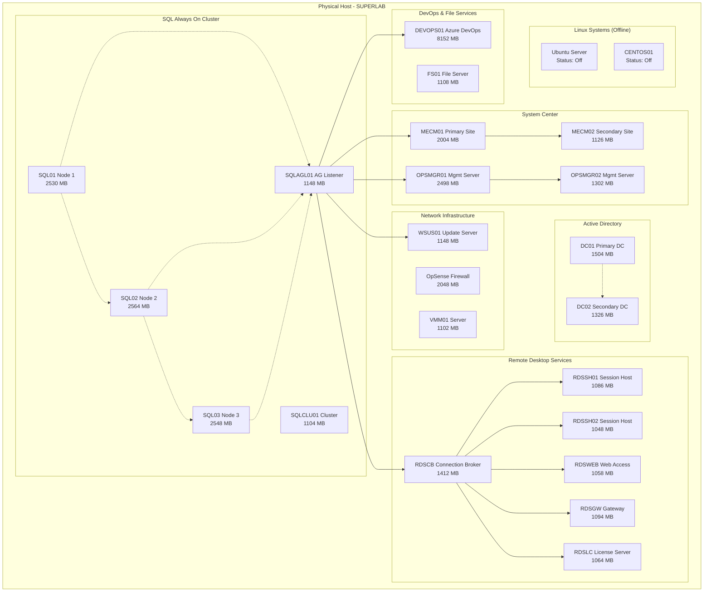
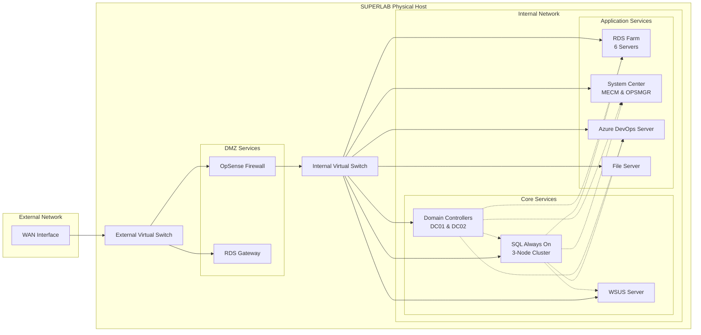

# Hyper-V Lab Infrastructure Documentation
## Overview
This documentation describes the comprehensive Hyper-V lab environment running on SUPERLAB, a Supermicro server hosting a complete Microsoft enterprise infrastructure stack.

## Physical Infrastructure
**SUPERLAB Host Server:**
- **Hardware:** Supermicro Super Server
- **Operating System:** Windows Server 2022 Datacenter
- **CPU:** AMD EPYC 3251 8-Core
- **Memory:** 255.89 GB RAM
- **Storage:** 8005.8 GB

## Architecture Diagrams
### Detailed System Architecture
The detailed architecture shows all virtual machines, their roles, and interconnections:

### Network Overview
The network overview diagram illustrates the network topology and service dependencies:

## Infrastructure Components
### Network & Security Infrastructure
- **OpSense:** Firewall/Router (2048 MB)
- **VMM01:** VMM Server (1102 MB)
- **WSUS01:** Update Server (1148 MB)

### Active Directory Domain Services
- **Domain:** myhomelab.hv.lab
- **DC01:** Primary Domain Controller (1504 MB)
- **DC02:** Secondary Domain Controller (1326 MB)

### SQL Server Always On Availability Group
- **SQL01:** SQL Server Node 1 (2530 MB)
- **SQL02:** SQL Server Node 2 (2564 MB)
- **SQL03:** SQL Server Node 3 (2548 MB)

### SQL Support Services
- **SQLAGL01:** AG Listener (1148 MB)
- **SQLCLU01:** Failover Cluster (1104 MB)
- **CAUSQLCL4bu:** Cluster Virtual Network

### Hosted Databases
- **Configuration Management:** AzureDevOps_Configuration, AzureDevOps_myhomelab, CM_MHL
- **Operations Management:** OperationsManager, OperationsManagerDW, RDSCB_DB
- **Update Services:** SUSDB (Windows Update Services)

### Remote Desktop Services Farm
- **RDSCB:** Connection Broker (1412 MB)
- **RDSGW:** RDS Gateway (1094 MB)
- **RDSLC:** License Server (1064 MB)

### RDS Session Hosts
- **RDSSH01:** Session Host 1 (1086 MB)
- **RDSSH02:** Session Host 2 (1048 MB)
- **RDSWEB:** Web Access (1058 MB)

### System Center Configuration Manager
- **MECM01:** MECM Primary Site (2004 MB)
- **MECM02:** MECM Secondary Site (1126 MB)

### System Center Operations Manager
- **OPSMGR01:** Management Server 1 (2498 MB)
- **OPSMGR02:** Management Server 2 (1302 MB)

### DevOps & File Services
- **DEVOPS01:** Azure DevOps Server (8152 MB)
- **FS01:** File Server (1108 MB)

### Offline Systems
- **UBUNTU:** Ubuntu Server (Status: Off)
- **CENTOS01:** CentOS Server (Status: Off)

## Network Architecture
### Physical Network Interfaces
- **WAN Interface:** External connectivity
- **LAN Interface:** Internal network access

### Virtual Network Infrastructure
- **External Virtual Switch:** WAN access for external-facing services
- **Internal Virtual Switch:** LAN trunk for internal communication

### Service Dependencies
SQL Server Always On Availability Group provides database services to:
- Azure DevOps Server
- System Center Configuration Manager
- System Center Operations Manager
- Remote Desktop Services Connection Broker
- Windows Server Update Services

## High Availability Features
### SQL Server Always On
- Three-node availability group with automatic failover
- Cluster support services for enhanced reliability
- Distributed database hosting for critical applications

### Active Directory Replication
- Dual domain controllers with automatic replication
- Redundant DNS and authentication services

### System Center Redundancy
- Multiple management servers for both Configuration Manager and Operations Manager
- Load balancing and failover capabilities

## Management and Monitoring
The infrastructure includes comprehensive management through:
- **System Center Operations Manager:** Infrastructure monitoring
- **System Center Configuration Manager:** System deployment and updates
- **Windows Server Update Services:** Centralized patching
- **Azure DevOps Server:** Development lifecycle management

## Notes
The environment demonstrates enterprise-grade Microsoft technologies with proper redundancy and high availability configurations.
