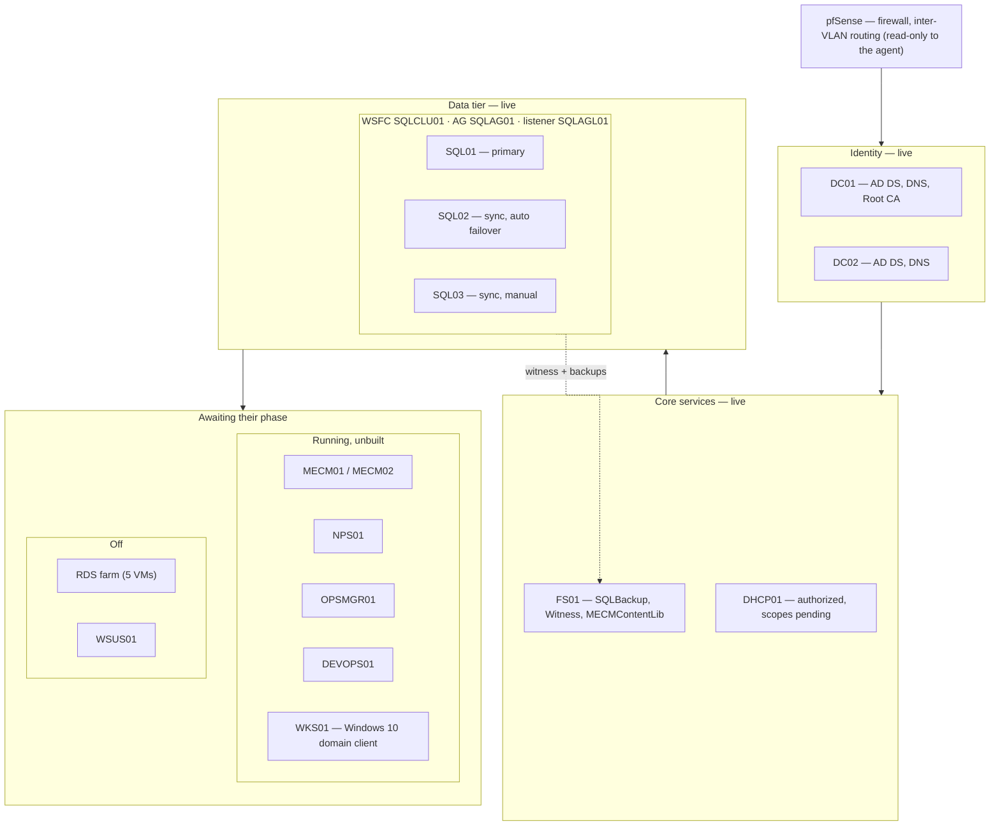
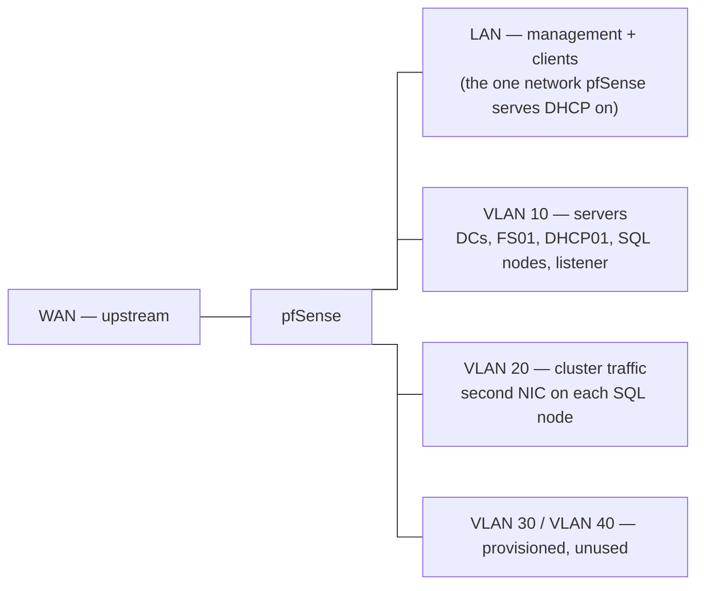

# Five days, one data tier

On day one this lab was two healthy domain controllers and twenty VMs
of mostly blank disk. Five days later it has core plumbing (file
server, DHCP, a reusable OS template), an identity foundation
(enterprise PKI, group managed service accounts), and a live data tier:
a three-node SQL Server 2022 Always On availability group that has
already passed a planned failover test. Most of the work was executed
by an autonomous operations agent inside explicit guardrails, with
every step logged and verified against live state.

## The five days

**Day 1 — survey.** Inventory everything before touching anything. The
go/no-go gate — AD health — passed cleanly on both DCs. Almost
everything else was greenfield: eight VMs had never had an OS
installed, and the running "servers" were blank workgroup installs.
Verdict: build, not repair.

**Day 2 — core plumbing.** FS01 built and serving the three shares
later phases depend on (SQL backups, cluster witness, MECM content).
DHCP01 domain-joined, role installed and AD-authorized; scopes deferred
until the firewall's own DHCP state was confirmed. The install fights
were fixed permanently in a generalized Windows Server 2025 template —
every VM since deploys unattended in about ten minutes.

**Day 3 — identity foundation.** Enterprise Root CA on DC01,
certificate autoenrollment via GPO, and the gMSA groundwork: KDS root
key, groups, and service accounts — created against pre-staged computer
objects for servers that did not exist yet. That bet paid off two days
later.

**Day 4 — access work.** Read-only SSH onto the firewall (a dedicated
low-privilege account; the agent never modifies pfSense). The config
capture answered the DHCP question: pfSense serves the LAN only, so the
server VLANs belong to DHCP01. CA-side smartcard-logon preparation was
completed the same day.

**Day 5 — the data tier.** Three SQL nodes deployed from the template
overnight, clustered with a file-share witness on FS01, SQL Server 2022
installed unattended with gMSA service accounts from first start, and
availability group SQLAG01 brought up with a listener. A supervised
failover test closed it out: primary lost and restored in a two-minute
round trip, replicas healthy and synchronized throughout. Full detail
in the previous post.

## Current state



Each layer depends on the ones above it: the cluster authenticates
against the DCs, quorum and backups live on FS01, and every pending
phase lands its database on the availability group listener.

And the network under it, simplified — pfSense trunks all VLANs and is
the only router between them:



## Key lessons

1. **Guardrails made the build better, not slower.** The agent's
   permission layer refused AD deletions, disk formatting, cluster
   creation, and a broad ACL grant. No refusal stalled the project —
   each produced a less-privileged path or a staged script for morning
   review, and two refusals directly improved the design.
2. **Front-load identity work.** gMSA groups created against pre-staged
   computer objects meant the SQL nodes retrieved their service
   accounts on first domain boot. No password ever existed.
3. **A day on a template repays itself immediately.** Three install
   stalls were debugged once and never recurred.
4. **Survey first, and let the verdict be honest.** Half a day of
   inventory made rip-and-replace the obvious call everywhere except
   AD, which was healthy and stayed untouched.
5. **Verify, then claim.** Every "done" ties to a check — cluster
   validation, AG state, error-log evidence. That discipline caught two
   script bugs before they became mysteries.

## Gotchas worth stealing

- **Pre-staged AD computer accounts block plain domain joins.** Don't
  delete them: rename the machine to its target name, then join with an
  account that has rights on the object. The join adopts the account
  and preserves its SID and group memberships.
- **`sysprep /generalize` does not reset the MachineGuid.** Every clone
  inherits it — a real problem for anything anchoring identity to it
  (MECM's client GUID, for one). Bake a specialize-pass delete into the
  template so each clone regenerates its own.
- **Optical media stalls unattended installs twice**: the "press any
  key" boot prompt (fixed by injecting keystrokes right after VM start)
  and the licensing screen (fixed with the AVMA key in the answer
  file).
- **An attached ISO can steal your drive letter.** The SQL media
  claimed E: — the planned data volume. Park the DVD on a high letter
  first, and make disk scripts idempotent.
- **The built-in WebServer template won't autoenroll** as shipped — its
  name flag expects the subject in the request. Switch it to build the
  subject from AD; the ACL grant alone does nothing.
- **A new KDS root key needs ~10 hours** before use unless you backdate
  its effective time. Fine in a lab, never in production.
- **AG listeners fail on AD rights, not SQL.** Pre-stage the listener's
  computer object disabled and grant the cluster account control over
  that one object — better than opening the whole Computers container.
- **Never restore a checkpoint of one node in a live availability
  group** — it desynchronizes the group. The rollback for a planned
  failover is the failback.

## Tooling on an air-gapped node

A small follow-up worth recording: SQL Server Management Studio 22
needed to go on one of the SQL nodes, and the server VLAN has no route
to the internet by design. The fix is normally simple — build an
offline installer layout on a machine that does have internet:

```console
vs_SSMS.exe --layout C:\SSMSLayout --quiet
```

then copy that folder across — but SSMS 22's installer is built on the Visual Studio
bootstrapper, which verifies its own package signature before doing
anything else. That check needs the full certificate chain present
locally; an offline machine can't fetch a missing link the way an
internet-connected one silently does. The failure looked like a bad
download (`InvalidCertificate`, no useful detail) until the bootstrap
log — `dd_bootstrapper_<timestamp>.log` in the installing user's
`%TEMP%` folder — pointed at signature verification specifically.
Microsoft documents the fix: two certificates — a root and, less
obviously, an intermediate signing certificate — installed manually
into the local machine's trust store. Both imported clean from a
source that already trusted them, and the install then ran unattended
without touching the network at all.

## What's next

Attention will turn to what the data tier was built for, in order:
MECM in an active-passive high-availability configuration, the RDS
farm with a highly available broker, SCOM, and Azure DevOps Server —
every one of them landing its database on the listener. DHCP scopes
and the NPS build follow later, along with smartcard logon domain
wide.
