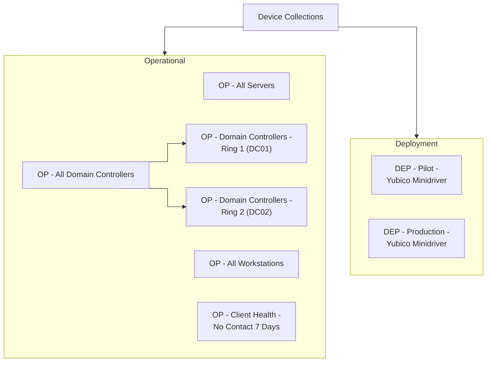

# Configuration Manager, end to end

The data tier from the last post now has its first real tenant. MECM01
is a live Configuration Manager primary site, MECM02 is a working
passive site server for high availability, WSUS01 is the software update
point, and the site can now discover a client, install the agent, and
push an application to it. This post is the build log for that work,
including the parts that didn't go cleanly the first time. There were
more of those than usual, and each one earned its place in this write-up.

## Where this sits in the plan

MECM was always going to be one of the harder builds on the roadmap: a
primary site server, a passive HA partner, a software update point, and
— new this round — the operational scaffolding a real site needs before
it can manage anything at all: discovery, boundaries, collections, a
distribution point, and a first deployed application. All of it sits on
the SQL Always On availability group from the previous post, so every
guardrail from that build — one node at a time, dashboard green between
changes, checkpoint before anything risky — carried over here as well.

**Timeline, for the record.** First contact with this build was 6:30 AM
on Day 1, when the host hit a missing-.NET-Framework wall while staging
prerequisites. The first application landed on its first client at 9:27
AM on Day 3. That's a little over fifty hours of elapsed time end to
end — not continuous effort, but three distinct sessions: node
preparation and the MECM01 primary site install on Day 1, the full
MECM02 high-availability effort on Day 2, and discovery, boundaries,
collections, and the first application on Day 3. Some of that elapsed
time is the guardrails doing their job: several steps needed my
explicit go-ahead before the agent could move forward, and I'm not
glued to this lab around the clock, so a blocked step sometimes just
sat there until I noticed it. The high-availability work alone took the
better part of a day, and the next section explains why.

## Two mistakes on the host, and what they're worth remembering for

Before any of this touched a guest VM, the site installation tooling had
to be downloaded on the Hyper-V host itself, simply because it's the
machine with a real path to the internet. That produced two problems
worth recording plainly rather than smoothing over.

The first was straightforward: the Configuration Manager prerequisite
downloader needs .NET Framework 3.5 on whatever machine runs it, and the
host had never had it installed. Not a guest gap — a host gap, and one
that only surfaced because the tool refused to start.

The second is the one worth pinning to the wall. The first attempt to
fetch prerequisites ran `setup.exe /downloadprereq`, which is not the
headless downloader it sounds like — it's the full
interactive Configuration Manager Setup Wizard. It opened on the host's
own console. I caught it on my screen, captured it, and asked the agent
what I was looking at. The agent realized it had pointed the wrong tool
at the wrong target: prerequisite download should never invoke an
interactive installer, and it should certainly never put a setup wizard
on the console of the machine that manages the entire lab. It then
initiated a two-track fix — cancel the wizard and terminate both the
`setup` process and a stale `SetupWpf` child it had spawned, and switch
to the tool actually built for this job: `Setupdl.exe /NOUI`, a
separate utility that never renders anything on screen.

Nothing was damaged, but that's beside the point. This was caught only
because I happened to be watching the console at that exact moment — an
agent pointing the wrong installer at the wrong target is not a minor
slip. It belongs in a permanent record, not a footnote. Host-side
tooling for a guest install is a legitimate pattern, crucial in this
lab: the host is the one machine with an internet connection, so ISO
staging, offline ADK layouts, and everything like them all need to be
downloaded to the host, and have been, without incident.

So what's the actual fix? I don't have one yet, but I am sure it is not
"don't let the agent touch the host" — that would throw away a pattern
that otherwise works. And the real risk isn't just a wizard popping up
somewhere I happen to be looking. It's that a full application could
get installed on the host with nobody watching at all. I've made a
note to keep researching real ways to guard against this class of
risk, and I hope to have something worth sharing in a future post.

## MECM01: the primary site

Once the host-side tooling download was sorted out, the primary site
install ran into three blockers, each requiring fixes before moving
forward:

1. **SQL local administrator rights.** MECM01's computer account needed
   local administrator rights on all three SQL nodes before setup would
   even clear its prerequisite check. This isn't called out prominently
   in the documentation; the agent dug it out of `ConfigMgrPrereq.log`.
2. **The same stale-process lock, again.** Partway through the MECM01
   install, a retry attempt just sat there, doing nothing. The agent
   traced it back on its own, no screenshot needed this time: an earlier
   attempt on this same machine had been cancelled, leaving a
   `SetupWpf.exe` process behind that still held a single-instance lock
   — the identical failure mode from the host incident above, because
   the cleanup step again killed only the process named `setup` and
   missed its WPF child. Same fix: terminate both process names before
   relaunching.
3. **Availability group settings that ConfigMgr requires, then expects
   you to reverse.** The agent found this one on its own as well:
   ConfigMgr's own prerequisite check demands `ALLOW_CONNECTIONS = ALL`
   on the secondary role and `FAILOVER_MODE = MANUAL` on every replica
   during setup. Two of the three SQL nodes were on automatic failover
   from the previous build and had to be switched, but the
   availability group is guarded infrastructure in this lab, so the
   agent stopped, proposed the exact setting change for each node, and
   waited for approval. Microsoft's
   documentation is explicit that these settings should be reverted
   once installation completes; that reversal is deliberately deferred
   until MECM02's high-availability work — which touches the same
   setting — is fully done and verified.

The install completed cleanly after that: site code **MHL**, database
`CM_MHL` on the availability group listener, synchronized across all
three replicas.

## Moving the content library, and the distribution point that went away with it

The agent followed standard practice to keep a primary site server's
content library off the site server itself, so early in the
build the library was moved to `\\FS01\MECMContentLib\ContentLibrary`
and MECM01's local Distribution Point role was removed to allow the
move. Sound practice on its own terms. The problem is what it left
behind: nothing replaced that Distribution Point. For a stretch of this
project, the site had zero distribution points anywhere — a gap that
stayed invisible right up until the boundaries and collections work
needed to push a client and an application to something real.

## MECM02: the passive site server, blocker by blocker

The high-availability build was the longest troubleshooting sprint of
this entire phase, and it starts with a point worth stating plainly:
**adding a passive site server has no PowerShell equivalent.** Microsoft's
own documentation confirms it. The "Create Site System Server" step has
to be run through the console manually — there is no cmdlet, no
supported script, no automation path around it. Once that manual step
was done, the agent handled every retry after it through
`SMS_SCI_SysResUse`'s undocumented `RetryInstallation` WMI method,
because there's no cmdlet for that step either. What it took, in the
order each blocker surfaced:

1. **Windows Firewall on MECM02 had File and Printer Sharing disabled
   entirely** — no inbound SMB, no inbound ICMP. MECM01 had no path to
   reach it at all.
2. **MECM01's computer account had no local administrator rights on
   MECM02.** The passive-server health check authenticates as the
   active site server's own machine identity; without local admin
   there, every remote check failed with a misleading "OS version not
   supported" message, because the check couldn't read the registry to
   determine the real OS version in the first place.
3. **A ConfigMgr-provisioned security group had never been used.**
   `SMS_SiteToSiteConnection_MHL` already had share-level access to the
   install source, but zero members and no NTFS grant on the actual
   content folder. It exists specifically for this scenario and had
   simply never been populated.
4. **The WSUS Administration Console was missing on MECM02.** Any site
   server — passive or active — needs it, independent of whether the
   software update point role is installed locally.

Each fix required the same follow-up: trigger `RetryInstallation`, and
because `SMS_FAILOVER_MANAGER` only re-reads its configuration when
`SMS_EXECUTIVE` starts, several of those retries needed a full service
restart on MECM01 before the change was even acknowledged. The passive
server eventually installed cleanly — file copy, WMI provider
registration, service bootstrap — through to `SMS_EXECUTIVE` and
`SMS_SITE_COMPONENT_MANAGER` running natively on MECM02.

### Where console screenshots did the job nothing else could

This is the part of the build where the most useful diagnostic work
came from my side, via the plain old Snipping Tool. At some point,
while looking over the messages on the console myself, it became clear
that the data the agent was retrieving programmatically kept coming
back incomplete. Several WMI queries over PowerShell Direct returned
blank fields for properties that were plainly populated —
`SMS_SCI_SysResUse`'s `NetworkOSPath` and `ServerState` came back empty
more than once. Since the console's own "Site Server Installation
Status" view carries detail that isn't exposed anywhere else — a
per-stage breakdown of prerequisite check, preparation, installation,
post-installation, and promotion, each with its own status and
description text — I captured four screenshots at different points,
saved each as a PNG, and gave the agent the PNG file path directly:

- The Site Server Status list itself, showing MECM02 as "Passive" with
  status "Installation failed" — confirmation that the console wizard
  submission had succeeded even though nothing had actually installed
  yet.
- The full per-stage breakdown, prerequisite by prerequisite. This is
  what actually surfaced the firewall and permission gaps above; the
  raw logs alone hadn't made the picture nearly this legible.
- Two further screenshots showing Post Installation landing on
  "Completed with warning," including the exact description text:
  *"Validate if the passive site server can be validated by the active
  site server. Check failovermgr.log on both passive and active site
  server for details."* That specific wording is what pointed the
  investigation at MECM02's own copy of the log rather than MECM01's
  alone, which is where the real explanation surfaced: a newly added
  passive server cannot decrypt secrets in the site database until it's
  actually promoted — by design, not a defect. Without that exact
  string, that would have been a considerably longer search.

Worth stating directly: this is a case where the agent's own tooling
genuinely could not retrieve the full picture, and a screenshot was the
fastest path to the answer — in one instance, the only path.

## The gap that had been there the whole time

By Day 3, the work turned to boundaries, collections, and the first
application. That work needed a real client, which needed a real
distribution point — and that's when the DP removed during the content
library migration finally mattered. Nothing had ever replaced it. Every
client install attempt failed at content lookup for the reason you'd
expect: there was nowhere to look.

### Where I'd have made a different call

The agent's recommendation was to place the content library and the
Distribution Point on FS01, since it kept MECM01's own load lean. I
accepted it, and it works — but I'd have made a different call: keep
the DP on MECM01, with a second or third drive dedicated to
content, rather than turn FS01 into a second managed site system.

FS01 is a file server — SMB in, SMB out, full stop. Standing up a
Distribution Point there meant installing IIS and BITS on a box that
never needed a web server, and it means a second machine now carries
its own security surface and permission model into every future
content-related incident. Keeping the DP on MECM01 keeps the failure
domain in one place.

The build backed up the instinct, and the agent found both examples on
its own: IIS and BITS were completely absent on FS01 and had to be
installed from local media, since FS01 has no internet access by
design. And a share-permission mismatch — the share granted
`Authenticated Users` Read while NTFS granted `Administrators` full
control, and the more restrictive of the two wins — caused a bare
`Access Denied` until it was widened.

Neither was a hard blocker, but both are exactly the friction that
shows up when a role is split across two machines instead of kept on
the one already doing the job. I accepted FS01 here because unwinding
the earlier decision felt like more churn than it was worth. Starting
from a blank slate, MECM01 with a dedicated drive is where I'd land —
every role you add to a second machine is a second machine you now
have to think about during every future incident.

## Boundaries, collections, and the client

With the distribution point question settled, the remaining pieces came
together in a single session:

- **IP boundaries**, one per active VLAN — the servers VLAN, two
  reserved VLANs, and the untagged workstation LAN — explicitly
  excluding the VLAN dedicated to SQL cluster heartbeat traffic. No
  client will ever live there, so a boundary would be pure overhead. One
  boundary group references MECM01 as the management point and FS01 as
  the distribution point.
- **A deliberately small collection set**, not the hundred-plus
  collection templates some public scripts generate by default. Two
  folders — Operational and Deployment — a handful of curated
  collections for servers, workstations, and client health, and, at my
  request, two collections that split the domain controllers into
  separate patch rings, so a future update deployment can never target
  both domain controllers in the same maintenance window.
- **AD System Discovery had no scope configured at all** — an empty
  container list, silently discovering nothing since the site was
  installed. Once fixed, the pilot workstation still needed moving out
  of the default `Computers` container into a real organizational unit
  before discovery would ever see it. It would also have remained
  invisible to any Group Policy Object applied at the OU level,
  autoenrollment included.
- **The client install itself** repeated a lesson learned during the
  MECM02 work: `ccmsetup.exe` needs a `/mp:` switch to know where to
  retrieve its own installation payload, entirely separate from the
  `SMSMP=` client property, which only configures the installed client's
  ongoing site assignment. Supplying only the property produced a
  client that attempted, and failed, to discover a management point
  through Active Directory publishing that doesn't exist in this
  environment.

Here's how the collection set actually broke down:



The pilot workstation came up site-assigned. `ccmsetup.log` shows the
site code going out with the rest of the install parameters:

```
Params to send '5.0.9106.1000 Deployment "C:\WINDOWS\ccmsetup\ccmsetup.exe"
/runservice  SMSMP="MECM01.myhomelab.hv.lab" SMSSITECODE="MHL"'
```

And the client itself confirms it after the fact:

```
CcmExec: Running
MHL
```

## The first application: proven, mostly

The first software pushed through this pipeline was the Yubico Smart
Card Minidriver, the driver behind the PIV smartcard logon work from an
earlier post. It's packaged as a proper Application, not a legacy
Package, with the MSI's product code extracted automatically and a
silent install command.

Content distributed, policy reached the pilot client, and detection
worked both ways — correctly found present, from the earlier manual
install, and correctly found absent after a deliberate uninstall.

What never got proven was forcing an actual reinstall. Several valid
attempts — a fresh policy cycle, a client restart, a later deadline,
even invoking the install method directly over WMI — all re-ran
detection instead of enforcing, even past the deadline. Most likely a
ConfigMgr client-side quirk, not a flaw in this build. Everything else
is proven; this one case isn't, and I chose to stop chasing it, with a
checkpoint in place if it needs revisiting.

## Lessons learned

- **An agent running an executable against the wrong target isn't a
  small thing.** That's exactly what put a live setup wizard on the
  host's own console. I'm not yet sure how to mitigate this class of
  risk.
- **Keeping the content library, and then the distribution point, on a
  second machine added real complexity that a same-box setup would
  never have hit** — installing IIS and BITS on a server that had never
  needed either, and the share-permission mismatch described above.
  That complexity is the whole basis for the dissent recorded earlier:
  it's a cost worth weighing before splitting a role across two
  machines, not just an incidental annoyance. One way to have avoided
  it: a more detailed prompt up front, instructing the agent to
  provision an additional drive for content on MECM01 and keep the
  distribution point there.
- **Adding a passive site server has no PowerShell path.** The "Create
  Site System Server" step must be run through the console by a person;
  everything downstream of that step can be automated through the
  undocumented `RetryInstallation` WMI method, but that first step
  cannot.
- **A screenshot is worth a hundred prompts.** More than once during the
  MECM02 troubleshooting, WMI queries came back with blank fields for
  data that clearly existed, and the console's own status views showed
  detail that wasn't exposed anywhere else. A screenshot handed directly
  to the agent settled the question in seconds where more log-digging
  would have taken far longer, and in one case was the only way to get
  the exact answer at all.
- **ConfigMgr's own prerequisite check requires availability group
  settings it expects you to reverse afterward**: `ALLOW_CONNECTIONS =
  ALL` on the secondary role and `FAILOVER_MODE = MANUAL` on every
  replica, for the duration of setup only.

## Division of labor

The agent handled almost the entire install, the log investigations,
every WMI query, the entire high-availability troubleshooting sprint,
the boundary, collection, and Yubico driver application deployment,
and the first draft of this post. My part was the go-ahead on several
guardrails, the call on scope for pilot deployment testing, the
decision to hand over screenshots rather than let the agent keep
digging down a rabbit hole of logs, and, on a few occasions, looking at
my own screen and asking what I was looking at.

## What's next

MECM now has a working primary site, a working passive partner, and an
application deployment pipeline that's proven to work. Next I'd be
interested in testing how the agent handles a few things: a genuine
failover test between MECM01 and MECM02, relocating MECM content to a
separate disk on MECM01 and adding the distribution point role there,
orchestrating patch deployment across the different deployment rings,
and whatever other scenario comes to mind.
