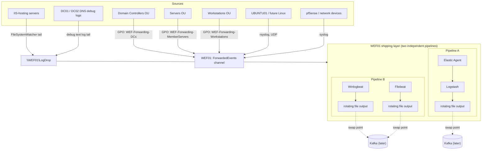

# A step-by-step guide: Windows Event Forwarding + a SIEM-shaped pipeline, built two different ways

Every server in SUPERLAB up to this point has kept its own Event Log,
its own IIS log files, its own DNS debug output — useful if you already
know which machine to look at, useless if you don't. This guide builds
`WEF01`, a single collector that every domain-joined Windows machine
forwards its events to natively, extended to also pull in Linux syslog
and file-based logs (IIS, DNS) that Windows Event Forwarding itself
can't reach.

Then it builds the same pipeline a second time, with different tools,
specifically so you can compare them side by side. That second build is
the real point of this post: if you're a junior engineer handed either
"stand up centralized logging with Elastic Agent" or "stand up
centralized logging with Winlogbeat and Filebeat," you should be able
to follow this guide and end up with a working pipeline either way —
and understand why you might pick one over the other.

**Who this is for**: someone comfortable with Windows Server and Active
Directory basics, who hasn't necessarily built a Windows Event
Forwarding subscription or an Elastic Beats pipeline before.

## What you'll end up with

- `WEF01`, a Windows Event Collector every domain machine forwards to,
  scoped by three tiers (domain controllers, member servers,
  workstations) via GPO and AD group membership
- Sysmon deployed fleet-wide with MITRE ATT&CK-labeled telemetry riding
  those same subscriptions
- Linux syslog (and, separately, network-device syslog) landing on the
  same collector
- IIS and DNS logs — both file-based, neither reachable by native Event
  Forwarding — shipped through a near-real-time file-tailing pattern
- **Two parallel, independently working shipping pipelines** on WEF01
  itself: one built on Elastic Agent + Logstash, one built on
  Winlogbeat + Filebeat, both writing to local rotating files with a
  clearly marked spot to swap in Kafka once that exists
- A pipeline you've verified actually moves data, not just one where
  every service says "Running"

## Architecture



## Prerequisites

- A Hyper-V host with an existing AD domain, at least one reachable DC
- A template VM you can clone Windows Server from (see this lab's own
  generalized-template post if you need one)
- An OU structure to place computer/group objects into (this lab uses
  `OU=Servers,OU=LabOU` — adjust to whatever yours is)
- A Linux host you can experiment with `rsyslog` on, if you want to
  follow the syslog section
- About half a day if you're building both pipelines end to end; a few
  hours for just one

---

## Phase 1 — Provision the collector

Nothing special here beyond your normal VM build: clone from template,
join the domain, land the computer object in your servers OU (not the
default `CN=Computers` container — new AD objects should always go
somewhere deliberate). Give it a second data disk (`D:`) — you'll want
somewhere other than the OS disk for log output, the IIS/DNS drop
share, and eventually Logstash's own install.

Sizing: 2 vCPU / 4 GB is enough to start. The JVM inside Logstash is
the single biggest memory cost in either pipeline; watch it if you add
volume later.

## Phase 2 — Sysmon, fleet-wide, with ATT&CK labels

Deploy Sysmon before building the subscriptions in Phase 3, so the
subscription queries can include its channel from day one instead of
being edited again later.

- **Config choice**: [Olaf Hartong's `sysmon-modular`](https://github.com/olafhartong/sysmon-modular)
  over the more common SwiftOnSecurity baseline, specifically because
  it embeds MITRE ATT&CK Tactic/Technique IDs directly into each rule's
  name — a simple field dissect downstream gets you structured
  `attack.tactic` / `attack.technique` fields for free. This lab used
  the repo's `sysmonconfig-with-filedelete.xml` variant for the added
  file-delete visibility. Pin the exact commit you pull the config
  from, same as you'd pin the Sysmon binary version.
- **Deployment mechanism**: whatever your lab already uses for
  software rollout (this lab used MECM, since that was already the
  established pattern). The two things that matter are (a) pin
  specific versions rather than tracking `latest`, and (b) roll out to
  workstations/member servers first, domain controllers as a separate,
  more deliberate pass later.

### The mistake worth knowing about before you make it yourself

Sysmon's real Event Log channel name is:

```
Microsoft-Windows-Sysmon/Operational
```

**Not** `Microsoft-Windows-Sysinternals-Sysmon/Operational` — that
longer name is an easy one to type from memory or carry over from
older documentation, and the failure mode is brutal: every
`Get-WinEvent -ListLog`, every subscription query, every health check
against the wrong name returns a generic "log not found" error that
looks exactly like Sysmon being broken, even when it's installed,
running, and logging perfectly. Verify the real name yourself before
trusting any script (including this one) that hardcodes it:

```powershell
wevtutil el | Select-String Sysmon
```

Second, smaller gotcha, once you have the right channel name: **Sysmon's
default manifest ACL does not grant `NT AUTHORITY\NETWORK SERVICE` read
access**, and that's the identity WinRM's Event Forwarding Plugin runs
as when a subscription pulls events. Every built-in Windows channel
(Security, Application, System) explicitly grants it; Sysmon's does
not. The symptom is a subscription that authorizes fine and forwards
every other channel, but silently drops Sysmon events — or fails with
a generic WSMan 1818 fault that looks identical to ordinary transient
churn. Diagnose it by diffing the raw ACL against a known-working
channel:

```powershell
wevtutil gl Microsoft-Windows-Sysmon/Operational | Select-String channelAccess
wevtutil gl Security | Select-String channelAccess
```

Security's SDDL includes `(A;;CC;;;NS)`; Sysmon's does not include any
`;NS)` ACE at all. Fix it (idempotent, safe to re-run on a channel that
already has the grant):

```powershell
$channel = 'Microsoft-Windows-Sysmon/Operational'
$sddl = (wevtutil gl $channel | Select-String 'channelAccess').ToString() -replace 'channelAccess:\s*', ''
if ($sddl -notmatch ';NS\)') {
    wevtutil sl $channel "/ca:$($sddl)(A;;0x1;;;NS)"
}
```

The general lesson under both of these: when something reads fine
locally as Administrator/SYSTEM but a service or subscription can't
consume it, look at what identity that service actually runs as, and
diff its permissions against something that already works. That
technique found this in minutes once applied; guessing at "maybe the
config is wrong" or "maybe reinstall it" cost a lot more time first.

## Phase 3 — The collector role, three GPOs, three subscriptions

Three tiers map to three OUs — Domain Controllers, Servers, Workstations
— so build three independently-scoped subscriptions rather than one
broad one. Each can be paused, re-queried, or retired without touching
the others.

On WEF01:

```powershell
wecutil qc /quiet
winrm quickconfig -force
```

Then, per tier, a GPO linked to just that OU with:

- Computer Config → Admin Templates → Windows Components → Event
  Forwarding → **Configure target Subscription Manager**:
  `Server=http://WEF01.yourdomain.tld:5985/wsman/SubscriptionManager/WEC,Refresh=900`
- Computer Config → Admin Templates → Windows Components → Windows
  Remote Management (WinRM) → WinRM Service → **Allow remote server
  management through WinRM**: Enabled

And a matching subscription created via `wecutil cs` with an XML
definition scoping `AllowedSourceDomainComputers` to that tier's AD
group (or the built-in `Domain Controllers` group for the DC tier).

### A subtle failure that looks like a permissions bug but isn't

If you scope a subscription to a **custom** AD security group instead
of individual computer SIDs, don't be surprised if newly-added members
get a flat "Access is denied" (WSMan fault 5) even though the group,
its membership, and AD replication all check out fine. This isn't a
group-authorization limitation — it's Kerberos. The forwarder
authenticates as its own computer account, and that account's TGT/PAC
(which is what encodes group membership for the SDDL check) is issued
at boot. A machine that was already running when it got added to the
group has a cached ticket that simply doesn't know about the new
membership yet.

**Fix**: reboot the machine after adding it to the forwarding group,
then force a retry:

```powershell
gpupdate /force /target:computer
Restart-Service EventLog
wecutil rs <SubscriptionName>
```

A separate, unrelated authorization layer needs widening too, or
non-admin source machines can't reach the collector at all regardless
of subscription scoping — the Event Forwarding Plugin's own WinRM-level
SDDL, by default, only allows `BUILTIN\Administrators` and `BUILTIN\Event
Log Readers`:

```powershell
$path = 'HKLM:\SOFTWARE\Microsoft\Windows\CurrentVersion\WSMAN\Plugin\Event Forwarding Plugin'
# add an (A;;GR;;;AU) ACE for Authenticated Users to the plugin's ConfigXML Sddl attribute
```

## Phase 4 — Linux and network-device syslog

No agent on the Linux side at all — the same "nothing extra runs on the
source" principle as everything else in this build. Point `rsyslog` at
WEF01:

```
# /etc/rsyslog.d/90-wef01.conf on the Linux host
*.* @@wef01.yourdomain.tld:514   # TCP; use a single @ for UDP
```

Network devices that support remote syslog natively (most firewalls,
switches) just need their syslog destination pointed at WEF01 the same
way — if your firewall is a shared, hands-off appliance in your
environment the way pfSense is in this lab, that's a change for
whoever owns it, not something to make unilaterally.

## Phase 5 — File-based logs: IIS and DNS, near-real time

Windows Event Forwarding can't reach IIS log files or DNS's debug text
log — they're not Event Log channels. Rather than polling for rotated
files every few minutes (real detection latency cost), this uses a
`FileSystemWatcher`-based tailer that reacts to writes as they happen:

- IIS opens its log files with share-read access, so the currently
  active file can be tailed while IIS is still writing to it.
- The tailer tracks a per-file byte offset in a small local state file
  (survives restarts) and appends only new bytes to
  `\\WEF01\LogDrop\<hostname>\IIS\`.
- Run it as a Scheduled Task, "At startup," restart-on-failure.
- DNS's live Analytical channel turns out to be a dead end for
  forwarding — see the callout below — so DNS uses the classic debug
  text-file log (`Set-DnsServerDiagnostics -EnableLoggingToFile`)
  shipped through the exact same tailer/drop-share pattern as IIS.

### Why DNS can't just forward its Analytical channel

The DNS Server's Analytical channel is a real ETW-backed Windows Event
Log channel, which makes "just forward it like everything else" the
obvious first idea — and it doesn't work. Analytic/Debug channels are a
"direct channel" type that Windows restricts hard: **no external
consumer can query or subscribe to one while it's enabled**, full stop.
This isn't a permissions gap you can fix with an ACL — it fails the
same way whether you try `Get-WinEvent`/`wevtutil` (`EvtQuery`) or a
real-time `.NET EventLogWatcher` (`EvtSubscribe`), both with the exact
same "cannot be performed over an enabled direct channel, must first be
disabled" error. The MMC Event Viewer *looks* like it reads these
channels live, but it has special-cased GUI logic — disable, snapshot,
re-enable, transparently — that isn't exposed to any external consumer,
including WEC. If you hit this with any Analytic/Debug channel, stop
looking for a forwarding fix and reach for the classic debug-log
workaround instead.

## Phase 6 — Shipping layer, approach A: Elastic Agent + Logstash

Install Elastic Agent in **standalone mode** (no Fleet/Kibana
dependency) plus Logstash on WEF01 itself. Four inputs, one output:

```yaml
outputs:
  default:
    type: logstash
    hosts: ["127.0.0.1:5044"]

inputs:
  - type: winlog
    id: windows-forwarded-events
    streams:
      - data_stream: { dataset: windows.forwarded }
        name: ForwardedEvents
        forwarded: true

  - type: udp
    id: syslog-udp
    streams:
      - data_stream: { dataset: udp.syslog }
        host: "0.0.0.0:514"
        processors:
          - syslog: { field: message, format: auto }

  - type: filestream
    id: iis-logdrop
    streams:
      - data_stream: { dataset: iis.access }
        paths: ['D:\LogDrop\*\IIS\*\*.log']

  - type: filestream
    id: dns-logdrop
    streams:
      - data_stream: { dataset: dns.debug }
        paths: ['D:\LogDrop\*\DNS\*\*.log']
```

Logstash's own pipeline, for now, is deliberately boring: `beats` input
on 5044 → a `file` output with size-based rotation. That output stanza
is the one thing that changes when Kafka exists later — nothing
upstream of it needs to know or care.

**One environment-specific gotcha worth flagging generally**: if you're
extracting either the Elastic Agent or Logstash zip on a Windows host
with Defender's real-time scanning on, expect extraction to crawl —
Defender scanning every one of the thousands of small files inside a
JVM-bundled package is a well-known performance killer. An extraction
exclusion for the install path, plus using .NET's
`[System.IO.Compression.ZipFile]::ExtractToDirectory` instead of
`Expand-Archive`, turned a stalled multi-hour extraction into a
few-second one.

## Phase 7 — Verify pipeline A actually works

Trigger one identifiable event per source tier and confirm it lands the
whole way through: source's local Event Log → WEF01's own
`ForwardedEvents` channel → Elastic Agent → Logstash's output file. Do
this independently for the DC tier, syslog, IIS, and DNS — each
mechanism can silently fail on its own without affecting the others.

**A verification bug worth naming**: searching Logstash's output for
`"hostname":"WKS01"` on a winlog-sourced event will find nothing, even
when the pipeline is completely healthy — that field always shows the
agent host (WEF01), not the original source. The field that actually
carries the source computer is `winlog.computer_name`. If your first
verification query comes back empty, check you're searching the right
field before concluding the pipeline is broken.

**A second one, worth naming just as clearly**: `Get-ChildItem`'s
reported file size and last-write-time on an actively-written output
file can lag well behind what's actually on disk, if the process
holding it open (Logstash's JVM, a beat, anything) buffers writes.
A file that looks frozen at some old size for hours might be
completely healthy — read its actual tail with `Get-Content -Tail`
before concluding a pipeline has stalled. Trusting `Get-ChildItem`
alone here produced a full false alarm during this build: an apparent
multi-hour "pipeline stopped" turned out to be nothing more than stale
directory metadata on a file Logstash was actively writing to every
second.

---

## Shipping layer, approach B: Winlogbeat + Filebeat

Everything above builds one complete, working pipeline. This section
builds a second one, side by side with the first, using the more
traditional single-purpose Beats instead of Elastic Agent — the
approach you're more likely to be handed a doc for if Elastic Agent
isn't your organization's standard, or if you just want something
lighter-weight and don't need Fleet-style centralized management at
all.

**Why you might pick this over Elastic Agent**: each Beat is smaller,
simpler, and does exactly one job — Winlogbeat only ever reads Windows
Event Logs, Filebeat only ever tails files/network inputs. There's less
abstraction between you and what's actually happening, which makes it
a good choice for anyone building their first log-shipping pipeline
and wanting a lower conceptual jump. The tradeoff is you're running two
separate processes with two separate config files where Elastic Agent
gave you one — and you lose Elastic Agent's ability to unify config
management under Fleet if you later want that.

Both approaches land on the same collector (WEF01), read the same
sources, and both stop at a local file with a Kafka-shaped door left
open — the architecture decision is about the shipping layer only, not
about what gets collected.

### Step 1 — Download matching versions

Match whatever Elastic stack version you're already running elsewhere
in the environment — mixing major versions across your Elastic tooling
is asking for subtle incompatibilities later.

```powershell
$version = '9.5.3'
Invoke-WebRequest "https://artifacts.elastic.co/downloads/beats/winlogbeat/winlogbeat-$version-windows-x86_64.zip" -OutFile "C:\LabOps\tools\winlogbeat-$version-windows-x86_64.zip"
Invoke-WebRequest "https://artifacts.elastic.co/downloads/beats/filebeat/filebeat-$version-windows-x86_64.zip" -OutFile "C:\LabOps\tools\filebeat-$version-windows-x86_64.zip"
```

### Step 2 — Extract and install as services

Same Defender-exclusion lesson from Phase 6 applies here — exclude the
extraction path first if real-time scanning is on:

```powershell
Add-MpPreference -ExclusionPath 'C:\Install', 'C:\Program Files\Winlogbeat', 'C:\Program Files\Filebeat'
Add-Type -AssemblyName System.IO.Compression.FileSystem

[System.IO.Compression.ZipFile]::ExtractToDirectory(
    'C:\Install\winlogbeat-9.5.3-windows-x86_64.zip', 'C:\Install\extract')
Move-Item 'C:\Install\extract\winlogbeat-9.5.3-windows-x86_64' 'C:\Program Files\Winlogbeat'

# repeat for filebeat, then from inside each install directory:
Push-Location 'C:\Program Files\Winlogbeat'; .\install-service-winlogbeat.ps1; Pop-Location
Push-Location 'C:\Program Files\Filebeat'; .\install-service-filebeat.ps1; Pop-Location
```

Both `install-service-*.ps1` scripts register a proper Windows service
(no NSSM or third-party wrapper needed) — you get `Set-Service` /
`Start-Service` / `Get-Service` against `winlogbeat` and `filebeat`
like any other service from here on.

### Step 3 — Winlogbeat config: the Windows-events tier

Winlogbeat's whole job here is to read the same local `ForwardedEvents`
channel Elastic Agent's `winlog` input reads in Phase 6 — the two can
point at the same channel with zero conflict, since Windows Event Log
readers don't compete for or consume events.

```yaml
# C:\Program Files\Winlogbeat\winlogbeat.yml
winlogbeat.event_logs:
  - name: ForwardedEvents
    tags: [forwarded, wef]

# For now: a local rotating file, so events are visible without
# standing up Elasticsearch/Kibana - the direct analogue of Logstash's
# file output in the other pipeline.
output.file:
  path: "D:\\WinlogbeatOut"
  filename: "winlogbeat-events"
  rotate_every_kb: 102400
  number_of_files: 10

# --- Kafka placeholder --------------------------------------------
# Swap the block above for this once Kafka exists - same one-stanza
# swap point as Logstash's output in the other pipeline.
#
# output.kafka:
#   hosts: ["kafka01.yourdomain.tld:9092"]
#   topic: "wef01-winlogbeat-events"
#   partition.round_robin:
#     reachable_only: false

logging.level: info
logging.to_files: true
logging.files:
  path: "D:\\WinlogbeatOut\\logs"
  name: winlogbeat
  keepfiles: 7
```

Start it and confirm real content is landing — don't trust the service
status alone (see the `Get-ChildItem` lag warning from Phase 7; it
applies here identically):

```powershell
Restart-Service winlogbeat -Force
Get-Content 'D:\WinlogbeatOut\winlogbeat-events-<today>.ndjson' -Tail 5
```

A genuinely healthy Winlogbeat produces lines like this within seconds
of restart — this one is a Sysmon registry event that rode the
member-server subscription from Phase 3, exactly the way it would
through the Elastic Agent pipeline:

```json
{"@timestamp":"2026-09-12T07:59:15.505Z","winlog":{"channel":"Microsoft-Windows-Sysmon/Operational","event_id":"12", ...},"tags":["forwarded","wef"], ...}
```

### Step 4 — Filebeat config: syslog, IIS, and DNS

Filebeat covers the three non-Windows-Event sources — one `udp` input
for syslog, two `filestream` inputs for the IIS/DNS drop-share files
already being populated by Phase 5's tailer.

```yaml
# C:\Program Files\Filebeat\filebeat.yml
filebeat.inputs:
  - type: udp
    id: syslog-udp-demo
    host: "0.0.0.0:5514"
    tags: [syslog, demo]
    processors:
      - syslog:
          field: message
          format: auto

  - type: filestream
    id: iis-logdrop-demo
    paths:
      - 'D:\LogDrop\*\IIS\*\*.log'
    tags: [iis, demo]

  - type: filestream
    id: dns-logdrop-demo
    paths:
      - 'D:\LogDrop\*\DNS\*\*.log'
    tags: [dns, demo]

output.file:
  path: "D:\\FilebeatOut"
  filename: "filebeat-events"
  rotate_every_kb: 102400
  number_of_files: 10

# --- Kafka placeholder --------------------------------------------
# output.kafka:
#   hosts: ["kafka01.yourdomain.tld:9092"]
#   topic: "wef01-filebeat-events"
#   partition.round_robin:
#     reachable_only: false

logging.level: info
logging.to_files: true
logging.files:
  path: "D:\\FilebeatOut\\logs"
  name: filebeat
  keepfiles: 7
```

Two things worth calling out explicitly, because both are the kind of
detail that only shows up once you actually run the thing:

**Filebeat has a built-in `syslog` input type — don't use it.** It's
deprecated as of the version this lab tested; starting it logs exactly
this warning:

```
"DEPRECATED: Syslog input. Use Syslog processor instead."
```

The current recommended shape is a plain `udp` (or `tcp`) input with a
`syslog` processor attached, which is what the config above uses — and
it's the same pattern Elastic Agent's own `syslog-udp` input already
uses in Phase 6, so learning it once covers both pipelines.

**Two Beats/agents can tail the same file with zero conflict.**
Filebeat's IIS/DNS `filestream` inputs above point at the exact same
drop-share files Elastic Agent already tails in Pipeline A. Each
shipper keeps its own independent read-offset registry, so there's no
locking issue, no duplicate-detection problem, and no need to choose
between running one pipeline or the other while you're evaluating both
— this is exactly how this lab ran both pipelines simultaneously
against the same live drop-share without any special handling.

**If you're pointing this at a live UDP port a production listener
already owns** (this lab's real syslog senders were already wired to
Elastic Agent's listener on UDP/514), don't fight over the port — bind
Filebeat's demo listener to a different one (5514 here) and open the
matching inbound firewall rule:

```powershell
New-NetFirewallRule -DisplayName 'Filebeat Demo Syslog UDP 5514' `
    -Direction Inbound -Protocol UDP -LocalPort 5514 -Action Allow
```

To make this pipeline authoritative instead of a side-by-side demo,
repoint your actual syslog senders at the new port and retire the other
pipeline's listener — nothing else about the config needs to change.

### Step 5 — Start both services and verify

```powershell
Set-Service winlogbeat -StartupType Automatic
Set-Service filebeat -StartupType Automatic
Restart-Service winlogbeat -Force
Restart-Service filebeat -Force
Get-Service winlogbeat, filebeat
```

Don't stop at "Running" — that's exactly the lesson this whole build
keeps teaching in different forms. Filebeat's own metrics log (emitted
every 30 seconds to its log file) is the fastest way to confirm each
input is actually processing events, without needing to dig through
potentially huge output files:

```powershell
Get-Content 'D:\FilebeatOut\logs\filebeat-<today>.ndjson' -Tail 50 |
    Select-String 'events_pipeline_published_total','processor'
```

A healthy syslog input, right after a test packet, looks like this
in that snapshot — one event received, matched against the syslog
processor, and published:

```json
"syslog-udp-demo":{"device":"0.0.0.0:5514","events_pipeline_published_total":1,
  "received_bytes_total":84,"received_events_total":1, ...}
"processor":{"syslog":{"1":{"success":1}}}
```

Send yourself a real test packet to confirm end to end, rather than
waiting for real traffic:

```powershell
$msg = '<134>Sep 12 08:10:00 test-sender demo: verification packet'
$udp = New-Object System.Net.Sockets.UdpClient
$bytes = [System.Text.Encoding]::ASCII.GetBytes($msg)
$udp.Send($bytes, $bytes.Length, '127.0.0.1', 5514) | Out-Null
$udp.Close()
```

### A standalone listener, for when you need to rule out the shipper entirely

The test packet above proves Filebeat received something, but if it
*doesn't* show up, you're left guessing whether the problem is the
network path, a firewall rule, or Filebeat's own config. A tiny
standalone UDP listener — no Beats, no Elastic Agent, nothing but raw
.NET sockets — answers "is anything even arriving on this port at all"
on its own, which cuts that guesswork in half:

```powershell
# Stop Filebeat first (or use a different port) - only one process can
# bind a given UDP port for receiving at a time.
$listener = New-Object System.Net.Sockets.UdpClient(5514)
$remoteEndpoint = New-Object System.Net.IPEndPoint([System.Net.IPAddress]::Any, 0)

Write-Host "Listening on UDP/5514 - Ctrl+C to stop"
try {
    while ($true) {
        $bytes = $listener.Receive([ref]$remoteEndpoint)
        $text  = [System.Text.Encoding]::ASCII.GetString($bytes)
        Write-Host "[$(Get-Date -Format 'HH:mm:ss')] from $($remoteEndpoint.Address): $text"
    }
}
finally {
    $listener.Close()
}
```

Run this on WEF01 in place of Filebeat, then fire the same test-packet
snippet from above (or point a real syslog sender at it) from another
machine. If the message shows up here, the network path and firewall
rule are both fine and any remaining problem is in Filebeat's own
input config — a smaller, more specific thing to debug than "syslog
isn't working." If it doesn't show up, you've just ruled Filebeat out
entirely and can go straight to checking routing and firewall rules
instead of staring at a YAML file that was never the problem.

## Comparing the two, now that you've built both

### Elastic Agent + Logstash

- **Processes to manage**: 2 (Agent, Logstash)
- **Config surface**: one YAML per input type, plus one Logstash pipeline file
- **Centralized management later (Fleet)**: built in, if you ever stand up Fleet/Kibana
- **Resource footprint**: Logstash's JVM is the heaviest single piece either way
- **Enrichment/routing before Kafka**: Logstash filters (dissect, aggregate, ECS mapping) — genuinely powerful
- **Kafka cutover later**: swap Logstash's one output stanza
- **Good first pipeline to learn on**: if you already know you'll want Logstash-side enrichment

### Winlogbeat + Filebeat

- **Processes to manage**: 2 (Winlogbeat, Filebeat)
- **Config surface**: one YAML per Beat
- **Centralized management later (Fleet)**: not available — no shared control plane
- **Resource footprint**: slightly lighter without Logstash's JVM, if you skip enrichment
- **Enrichment/routing before Kafka**: each Beat's own lighter processor set — less flexible, usually enough for straightforward shipping
- **Kafka cutover later**: swap each Beat's one output stanza
- **Good first pipeline to learn on**: if you want the simplest possible mental model — one Beat, one job

Both are legitimate answers to "how do I ship these logs somewhere."
The right one depends on whether you need Logstash's enrichment power
and Fleet's centralized management, or whether the fastest path to
"data is moving" matters more than that flexibility.

## What's next

- Kafka doesn't exist in this lab yet — both pipelines above are built
  with that swap in mind, but until it's real, "local rotating file" is
  the actual, load-bearing output for both.
- If you build the Winlogbeat/Filebeat pipeline as your only pipeline
  rather than side by side with Elastic Agent, you can drop the demo
  port (5514) and repoint your real syslog senders directly at
  Filebeat instead.

## If something doesn't match this guide

Every claim in this post came from checking the actual system state,
not from assuming a service's "Running" status meant data was flowing —
that distinction cost real debugging time more than once during this
build, on both the Sysmon channel and, later, on what turned out to be
nothing more than a stale file-size reading on a perfectly healthy
Logstash output. If a step here doesn't produce what it says it should
in your environment, read the actual content the pipeline is producing
before trusting either the service status or a directory listing.
